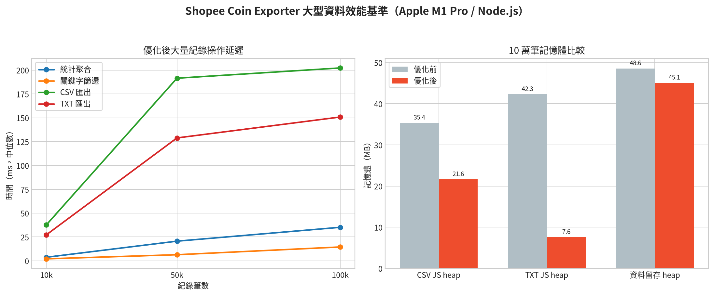

# 蝦幣活動分類與大型資料效能分析報告

作者：Manus AI
日期：2026-08-14

## 摘要

v1.3.0 將來源與使用分類改為獨立規則集合，先看交易方向、訂單編號等結構欄位，再使用 API 原始名稱與 reason。使用分類不再被商品名稱中的「直播」或「遊戲」等弱關鍵字影響；來源分類另加入訂單回饋、票券、VIP 寶箱、蝦幣寶箱及跨紀錄退款配對。每筆紀錄均保存規則 ID、信心與分類說明，UI 會顯示 fallback 金額占比並支援圖表下鑽。

效能測試使用 Apple M1 Pro、8 個邏輯核心、16 GB 記憶體及 Node.js v26.7.0，對 10,000、50,000 與 100,000 筆確定性合成紀錄執行統計、排序、關鍵字篩選、分類篩選、CSV 與 TXT 匯出。各資料量以獨立 Node 程序執行，重複操作採中位數；匯出採五次中位數。測試期間同一台 Mac 仍執行 Edge、DevTools 與其他應用程式，已排除明顯受作業系統排程阻塞的量測輪次，原始結果與方法均保留在專案內。[1] [2]

v1.3.0 最終基準中，10,000 筆分類約需 3.86 ms、統計 2.18 ms；100,000 筆分類約需 35.78 ms、統計 17.43 ms、關鍵字篩選 12.16 ms、CSV 匯出 200.17 ms、TXT 匯出 139.56 ms。這些本機運算不會成為上萬筆資料的主要等待來源；實際總抓取時間仍主要由蝦皮 API 的循序網路請求決定。

## v1.3.0 分類引擎 2.0 實測結論

2026-08-14 最終版在 Edge 已登入的蝦皮頁面完整取得 10,944 筆紀錄。使用分類共 10,336 蝦幣，其中「訂單蝦幣折抵」為 8,707 蝦幣（84.2%），「票券／服務兌換」為 1,629 蝦幣（15.8%），「其他使用」為 0 筆、0 蝦幣（0.00%）。這直接修正 v1.2.0 將 8,707 蝦幣訂單折抵錯放到其他活動，以及把商品名稱中的直播或遊戲文字誤認為活動消耗的問題。

來源分類以正向交易的訂單編號判定購物回饋，VIP 專屬寶箱歸入 VIP 訂閱，蝦幣／直營寶箱歸入蝦幣獎勵。最終「其他來源」同樣為 0 筆、0 蝦幣（0.00%）。退款配對只在「同訂單編號且同金額」或「同標題且同金額」時成立，共辨識 6 筆、3,181 蝦幣；有訂單編號但金額不同的正向商品紀錄會保留為購物／訂單回饋。

退款／沖正是原先使用蝦幣的返還，不屬於新獲得的獎勵。因此 v1.3.1 已將它從「期間實際獲得」及來源環狀圖排除，月份圖與獨立統計卡則單獨顯示退款；期間淨變動仍依 `實際獲得 + 退款／沖正 - 使用 - 過期` 計算，既避免放大總獲得，也不破壞餘額對帳。

2026-08-15 00:00 在 Edge 重新載入 v1.3.1 後，完整取得 API 當下可提供的 10,943 筆紀錄：期間實際獲得 8,078.52 蝦幣、退款／沖正 3,181.00 蝦幣、使用 10,336.00 蝦幣、過期 0.00 蝦幣，期間淨變動為 `8,078.52 + 3,181.00 - 10,336.00 = +923.52`。來源環狀圖中心總量同為 8,078.52，證實退款未納入總獲得；官方餘額 1,468.11 則可由推估期初餘額 544.59 加期間淨變動 923.52 對帳。紀錄數與前次差一筆是 API 一年滾動期間由 2025-08-14 推進至 2025-08-15 所致。

六筆退款均已找到相對負向項目：918、871、871、247 與 28 蝦幣五筆各有一筆相同訂單編號且相同金額的使用紀錄；246 蝦幣票券沖正則有相同標題且相同金額的使用紀錄。診斷腳本會逐筆輸出配對方式及對應筆數，回歸測試另驗證退款排除於實際獲得、但仍納入期間淨變動。

實際偵錯曾短暫採用「只要同訂單編號」即判定退款，結果把 11 筆、5,821.55 蝦幣錯放到退款／沖正。加入金額條件後，再由 CSV 檢查每筆規則 ID 與同訂單交易，確認 918、871、871、247、246 與 28 蝦幣六筆配對皆具有相同金額的負向紀錄或票券沖正依據。此過程已轉化為去識別化 fixture 及「同訂單不同金額不得視為退款」回歸測試。

### v1.3.0 最終本機基準

| 紀錄數 | 分類引擎 | 統計聚合 | 關鍵字篩選 | 分類篩選 | CSV 匯出 | TXT 匯出 | 紀錄物件 heap 增量 |
|---:|---:|---:|---:|---:|---:|---:|---:|
| 10,000 | 3.86 ms | 2.18 ms | 2.18 ms | 0.37 ms | 22.37 ms | 20.49 ms | 5.84 MB |
| 50,000 | 18.46 ms | 9.41 ms | 7.00 ms | 1.57 ms | 103.72 ms | 73.75 ms | 28.66 MB |
| 100,000 | 35.78 ms | 17.43 ms | 12.16 ms | 3.25 ms | 200.17 ms | 139.56 ms | 56.99 MB |

### v1.3.0 最終 Edge 端到端量測

| 指標 | 結果 |
|---|---:|
| 結果狀態 | complete |
| 紀錄數 | 10,944 筆 |
| 總耗時 | 26.54 秒 |
| 摘要 API | 316.30 ms |
| 交易頁 | 110 頁 |
| 平均／最慢頁耗時 | 179.44／257.20 ms |
| 固定分頁等待 | 5,450 ms |
| 整體吞吐量 | 412.4 筆／秒 |
| 分類引擎 | 12.10 ms |
| 其他來源／其他使用 | 0.00%／0.00% |



## v1.2.0 新增活動分類（歷史）

分類判斷採由具體到一般的優先順序，避免「完成訂單評價」先被歸入購物訂單，或「聯名卡消費回饋」先被歸入一般獎勵。分類規則使用名稱與 API reason 組成的完整標題。

| 新增分類 | 主要辨識詞 | 優先順序理由 |
|---|---|---|
| 短影音 | 短影音、短視頻、Shopee Video | 應先於一般活動或任務 |
| 每日登入 | 每日登入、每日登錄、登入獎勵、登錄獎勵 | 與既有每日簽到分開統計 |
| 評價 | 評價、評論、評分 | 應先於購物／訂單 |
| VIP訂閱 | VIP 訂閱、VIP 會員、會員訂閱 | 避免落入一般獎勵 |
| 蝦皮聯名卡 | 蝦皮聯名卡、聯名卡、蝦皮信用卡 | 應先於消費折抵或一般回饋 |
| 蝦幣獎勵 | 蝦幣獎勵、蝦幣回饋、Coin Reward | 作為官方泛用獎勵類別 |

v1.2.0 的分類清單共有 15 個可選項。v1.3.0 已改為 13 個來源分類與 6 個使用分類，並以 `classification.js` 集中管理；相關回歸測試會驗證實際型態標題、結構欄位與跨紀錄配對。

## v1.2.0 大型資料效能結果（歷史）

### 本機運算時間

| 紀錄數 | 建立資料模型 | 統計聚合 | 排序複本 | 關鍵字篩選 | 分類篩選 | CSV 匯出 | TXT 匯出 |
|---:|---:|---:|---:|---:|---:|---:|---:|
| 10,000 | 27.96 ms | 3.77 ms | 19.40 ms | 2.11 ms | 0.56 ms | 37.76 ms | 27.32 ms |
| 50,000 | 107.12 ms | 20.65 ms | 42.49 ms | 6.44 ms | 1.71 ms | 191.51 ms | 128.88 ms |
| 100,000 | 424.18 ms | 35.19 ms | 84.25 ms | 14.54 ms | 3.68 ms | 202.25 ms | 150.81 ms |

表格顯示統計、篩選與匯出在測試範圍內近似線性成長。100,000 筆的建立資料模型時間較容易受垃圾回收與系統排程影響，但仍在穩定量測的半秒內。正式測試另加入 100,000 筆篩選上限 500 ms 的回歸門檻，以防未來修改重新引入每筆昂貴字串轉換。

### 記憶體使用

| 紀錄數 | 紀錄物件 heap 增量 | CSV JS heap 增量 | CSV Blob／外部記憶體 | TXT JS heap 增量 | TXT Blob／外部記憶體 | 觀察到的最高 RSS |
|---:|---:|---:|---:|---:|---:|---:|
| 10,000 | 5.38 MB | 4.26 MB | 1.27 MB | 5.88 MB | 1.74 MB | 89.88 MB |
| 50,000 | 24.86 MB | 11.49 MB | 6.38 MB | 3.74 MB | 8.76 MB | 176.83 MB |
| 100,000 | 48.69 MB | 21.62 MB | 12.77 MB | 7.58 MB | 17.53 MB | 248.69 MB |

紀錄物件約以每 100,000 筆 49 MB 的 JavaScript heap 線性成長。100,000 筆 CSV 約 13.39 MB，TXT 約 18.37 MB；瀏覽器建立 Blob 時必須在外部記憶體保存輸出位元組，因此匯出期間會出現額外峰值。RSS 包含 V8 已保留但未立即交還作業系統的 heap pages，不能直接視為仍被程式使用的活資料；然而它可作為瀏覽器 renderer process 的保守容量參考。

優化前 100,000 筆 CSV 序列化額外使用 35.36 MB JavaScript heap，優化後約 21.62 MB，降低約 38.9%。TXT 由 42.29 MB 降為 7.58 MB，降低約 82.1%。完成抓取後不再同時長期保存 Map 與 Array，100,000 筆的資料留存 heap 由約 48.58 MB 降為 45.08 MB，容器部分減少約 3.5 MB。[3]

## 瓶頸分析

### API 網路與分頁是第一瓶頸

交易 API 以 offset 逐頁取得，每頁 100 筆且請求必須循序進行，否則容易造成頁面位移、重複資料或觸發限流。10,949 筆需要 110 頁。固定分頁間隔由 100 ms 降為 50 ms 後，純等待成本由約 10.9 秒降為 5.45 秒，節省約 5.45 秒；總時間仍需再加上 110 次 HTTP round trip、伺服器處理、重試與可能的 429 backoff。

因此，上萬筆情境中，資料抓取通常遠慢於後續統計與渲染。50 ms 是速度與站內 API 穩定性的折衷；完全移除間隔可能縮短理想情境時間，但會提高限流、驗證碼或部分資料結果的風險。

### Edge 真實資料 Debug 實測

2026-08-14 在 Microsoft Edge 已登入的蝦皮蝦幣頁面，以 `shopee_coin_debug=1` 啟用 v1.2.0 診斷模式並完整抓取 10,949 筆真實紀錄。結果狀態為 `complete`，總耗時 26.90 秒，帳戶摘要 API 為 280.00 ms，110 個交易頁平均 181.27 ms、最慢 284.60 ms，分頁節流等待合計 5,450 ms，整體吞吐量約 407.1 筆／秒；未出現失敗 offset 或重試錯誤。

這次端到端量測再次確認瓶頸在循序 API round trip 與刻意保留的分頁節流，而非前端統計、篩選或 SVG 圖表。Debug 面板亦成功顯示最近 12 個 `request:start`／`request:response` 事件、HTTP 200、offset 與單頁耗時；兩張「蝦幣來源分類佔比」和「蝦幣使用分類佔比」環狀圖及跨全寬月份趨勢圖均完成渲染。

### 關鍵字篩選原先是主要 CPU 熱點

舊邏輯對每一筆資料建立由標題、訂單編號與分類串接的新字串，接著執行 `toLocaleLowerCase('zh-TW')`。100,000 筆每次輸入都會產生大量短命字串與 locale 處理成本。新 `filters.js` 先判斷關鍵字是否包含拉丁字母；純中文搜尋直接對三個既有欄位做 `includes`，英文搜尋才執行一般 `toLowerCase`。100,000 筆穩定量測由約 201.62 ms 降至 14.54 ms，約快 13.9 倍。未設定任何篩選時直接重用來源陣列，不再建立 100,000 個元素的重複參照陣列。[3]

### 大型匯出的主要風險是峰值記憶體而非 CPU

CSV 與 TXT 現在每 500／250 筆組成一個區塊，立即以 `TextEncoder` 轉為 UTF-8 `Uint8Array`，避免同時長期保留完整 UTF-16 JavaScript 字串與最終 Blob。TXT 的 JS heap 峰值改善最明顯。不過 Blob 外部記憶體仍與檔案大小近似線性，且瀏覽器實作可能額外複製 ArrayBuffer；這是目前使用一般瀏覽器下載 API 無法完全消除的成本。

若未來實際紀錄超過 200,000 筆或單次匯出達數十 MB，下一階段應考慮 File System Access API 的串流寫入或在 extension service worker 內分段處理。現階段 100,000 筆的最高 RSS 約 249 MB，在 16 GB Mac 上可接受，但不適合無限制地繼續提高安全上限。

### DOM、圖表與表格不是主要瓶頸

表格固定只建立目前頁面的 15 至 100 列，使用 `DocumentFragment` 一次掛載。圖表只繪製最近 12 個月份及分類摘要，不會為每筆交易建立 SVG 元素。因此 100,000 筆情境下，DOM 數量仍保持固定級別；主要成本是前置統計與篩選，而不是瀏覽器 layout 或 paint。

### Edge 錯誤頁中的 `Failed to fetch` 是舊紀錄

使用者附件中的訊息為 `[ShopeeCoinCollector] Error fetching API page: TypeError: Failed to fetch`。目前工作樹已不存在這段 console 訊息，Git 歷史顯示它來自舊版 API 抓取器；Edge 的擴充功能錯誤頁會保留先前發生的錯誤，即使檔案內容已更新。現行 `fetchJSON` 會把網路失敗規範化為 `NETWORK`、逾時規範化為 `TIMEOUT`，最多重試三次並使用指數退避；摘要失敗降級為警告，交易頁最終失敗則回傳 `partial` 或 `failed` 結果交由 UI 顯示，不再直接以該舊訊息寫入 console error。

## 已完成的優化

| 區域 | 修改 | 效果 |
|---|---|---|
| 分類 | 新增六類並集中管理分類清單 | 規則與下拉選單不會漂移 |
| API | 分頁等待由 100 ms 降至 50 ms，保留 429／5xx backoff | 10,954 筆約少 5.45 秒固定等待 |
| 留存容器 | 抓取完成後清除 dedupe Map，只保留排序 Array | 100,000 筆約少 3.5 MB heap |
| 資料模型 | 移除未使用 timestamp、monthKey、amount 等重複欄位 | 減少建構與字串配置工作 |
| 篩選 | 抽離 `filters.js`、中文快速路徑、無篩選零配置 | 100,000 筆關鍵字篩選顯著加速 |
| 統計 | 月份由 dateStr 低成本擷取，避免每筆 regex | 保持單次 O(N) 聚合 |
| 匯出 | UTF-8 位元組分批編碼 | CSV／TXT JavaScript heap 峰值下降 |
| 測試 | 新增六分類、100,000 筆篩選及 benchmark 工具 | 可持續偵測效能退化 |

## 長期使用建議

以目前設計，10,000 至 100,000 筆可維持良好互動性。使用者正常查看統計與翻頁時，UI 不會一次渲染全部資料；搜尋有 200 ms debounce，因此快速輸入不會對每個鍵盤事件都掃描完整資料。

建議維持 200,000 筆安全上限，不要在沒有串流匯出與持久化設計的前提下提高。若蝦皮未來延長歷史保留期，應加入 IndexedDB 分批保存、以年月建立索引，並在統計時採增量聚合；目前所有資料只在記憶體中保存，重新整理即釋放，適合現有一年期約一萬筆規模，但不是無限期本地資料倉儲。

## 重現方式

```bash
node tests.js
node --expose-gc benchmark.js benchmark-results.json
node benchmark-compare.js benchmark-baseline.json benchmark-results.json benchmark-comparison.csv
python3 benchmark-chart.py
```

圖表步驟為選用項目，需先安裝 matplotlib。基準測試、比較工具、原始 JSON、比較 CSV 與圖表均已納入專案。基準結果會受 CPU 負載、垃圾回收、瀏覽器與其他應用程式排程影響，應以中位數和數量級判斷，不應把單次毫秒值視為硬性承諾。

## 參考資料

[1] [優化前原始基準資料](benchmark-baseline.json)

[2] [優化後最終基準資料](benchmark-optimized-final.json)

[3] [優化前後比較資料](benchmark-comparison.csv)

[4] [可重現基準工具](benchmark.js)

[5] [v1.3.0 最終原始基準資料](benchmark-v1.3.0.json)
